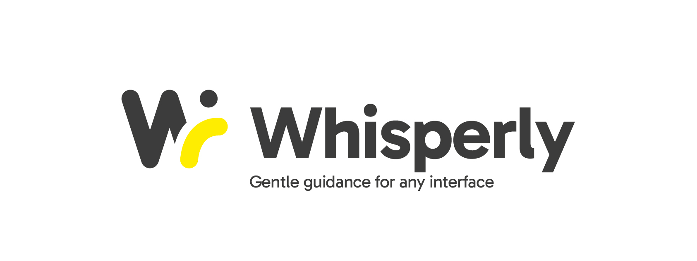

# 🌬️ Whisperly — Beta 0.1

**Gentle guidance for any interface.**  
_Contextual UX assistance, right when you need it._

Whisperly is a lightweight UX/UI assistant that lives in your browser.  
It captures your active tab and displays a **quick tip** in a **subtle overlay**.  
This first version is a **minimal MVP** — functional but experimental.

---

## ⚡ Installation (Developer Mode)

1. Clone this repo and open Chrome/Edge at `chrome://extensions/`.
2. Enable **Developer Mode**.
3. Click **“Load unpacked”** and select the `/src` folder.

> Note: the public landing page is in the **root**; the **extension** lives inside `/src`.

---

## 🔑 Setup

1. Click the Whisperly icon → the popup will open.
2. Paste your **OpenAI API Key** (stored **locally only** in your browser).
3. Press **“Capture & Analyze”**.

---

## 🚀 What this version does (MVP)

- Captures the current tab.
- Displays an **overlay** with a UX/UI tip (currently simulated).
- Privacy-first: your API key never leaves your browser.

> Next step: connect the capture to OpenAI vision endpoints (GPT-4o / gpt-4.1-mini-vision) for real suggestions.

---

## 🗺️ Roadmap

- [ ] Real vision call with heuristic prompts
- [ ] Suggestions history
- [ ] Overlay customization
- [ ] Tracker integrations (Jira/Linear)

---

## 📜 License

This project is licensed under **CC BY-NC-SA 4.0**. See `LICENSE.md` for details.  
© 2025 Pedro Figueras.
