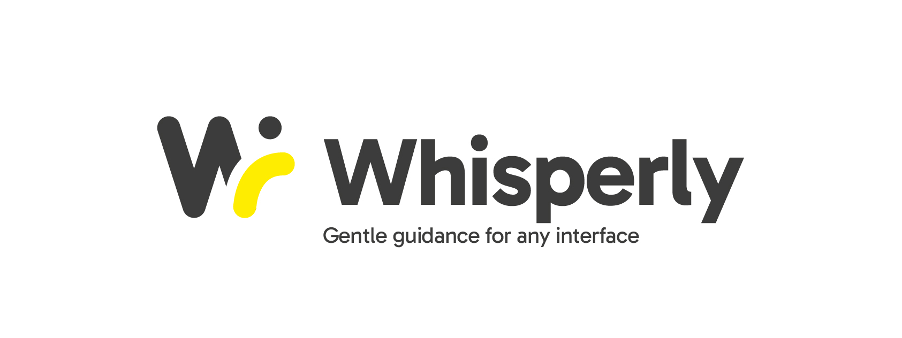

# Whisperly  

> **Gentle guidance for any interface.**  
> *Asistencia UX contextual, justo cuando la necesitas.*

Whisperly is an AI-powered assistant for real-time UX guidance inside any interface. It lives in your browser and offers subtle, intelligent suggestions based on what you're seeing — no interruptions, just clarity.

## 🚀 Features
- One-click screen capture and UX analysis.
- GPT-4 Vision-powered insights for any web interface.
- Browser overlay: non-intrusive, always available.
- Your data stays private: uses your own OpenAI API key.

## 🧪 Beta Version (For Technical Users)
Whisperly beta requires you to connect your own OpenAI API key to ensure full control, privacy, and zero cost for the developer.

## 🗺️ Roadmap
- [ ] Chrome Extension MVP
- [ ] DOM interaction analysis
- [ ] Adaptive prompts and UI feedback loop

## 📜 License
See LICENSE.md for details.

**Whisperly is an original concept by Pedro Figueras © 2025. All rights reserved.**